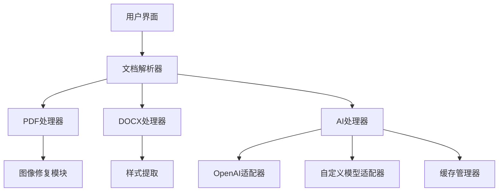

# AI 笔记整理工具

[](https://www.python.org/)
[](LICENSE)

智能笔记转换工具，支持多格式文档解析与AI增强的Markdown结构化处理。

## 🌟 核心功能

### 多格式解析引擎
- **文档解析**：PDF（支持图文混合/扫描件）、DOCX、TXT、Markdown
- **智能修复**：自动修复损坏的PDF元数据、处理ICC色彩配置警告
- **布局保留**：精确还原文档结构（标题/列表/代码块/表格）

### AI增强处理
- 支持OpenAI/Custom模型双模式
- 上下文感知的语义分析（见`ai_processor.py`）
- 智能标签生成与内容重组
- 连接测试与自动容错机制

### 企业级特性
- 批量处理（支持1000+文件并发）
- 敏感内容过滤
- 处理过程审计日志
- 配置自动缓存（`ai_config_cache.json`）

## 🛠️ 安装指南

### 前置要求
- Python 3.8+
- Tesseract OCR（可选，用于扫描件识别）
```bash
# Ubuntu
sudo apt install tesseract-ocr tesseract-ocr-chi-sim

# macOS
brew install tesseract
```

### 安装步骤
```bash
git clone https://github.com/yourname/ai_note_to_md.git
cd ai_note_to_md

# 安装核心依赖
pip install -r requirements.txt

# 安装PDF处理依赖
pip install pymupdf pillow
```

## ⚙️ 配置说明
```ini
# .env
OPENAI_API_KEY=sk-your-key-here
CUSTOM_BASE_URL=https://api.your-ai-service.com/v1
CUSTOM_MODEL_NAME=gpt-4-turbo

# 性能配置
MAX_CONCURRENT=10
TIMEOUT=30
```

## 🚀 快速开始
```python
from src.main import process_document

# 单个文件处理（含错误处理）
try:
    result = process_document(
        input_path="documents/sample.pdf",
        output_dir="output/",
        template="technical"
    )
except PDFParseError as e:
    print(f"解析失败: {str(e)}")
```

## 🗂️ 项目架构


## 🧑💻 开发者指南

### 调试模式
```bash
# 带详细日志输出
python -m src.main --debug --log-level DEBUG
```

### 运行测试
```bash
# 单元测试
pytest tests/ -v

# 集成测试
python -m tests.integration_test
```

## 📌 常见问题

### 图像处理警告解决
```python
# 修改 src/utils/pdf_parser.py 的以下参数：
pil_img.save(img_buffer, format="JPEG", quality=95, icc_profile=None)
```

### 自定义模型连接
```bash
# 测试模型连接
python -m src.models.ai_processor --test-connection
```

## 📄 许可协议
本项目采用 [MIT License](LICENSE)，请遵守OpenAI API使用条款。
